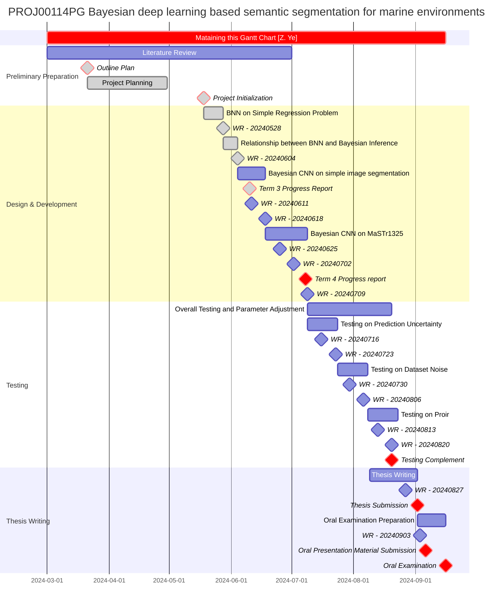

# BDL based Sematic Segmentation


## Overview
This is a MSc individual project to enhance the visual detection capabilities of USVs by utilizing Bayesian SegNet. This project aims to enhance the reliability of USVs in complex and dynamic marine environments despite the scarcity of marine datasets.

## Achievement
Bayesian SegNet on [MaSTr1325 dataset](https://www.vicos.si/resources/mastr1325/)


Bayesian SegNet on [OASIs dataset](https://www.navlue.com/dataset)


## Gantt Chart


## Dataset
The instructions of downloading datasets are illistruted in the [link](https://github.com/yezehao/BDL-based-semantic-segmentation/blob/main/Dataset/README.md).    
The corresponding `*.tar.gz` files of datasets are provided as well in [Dataset file](https://github.com/yezehao/BDL-based-semantic-segmentation/tree/main/Dataset).     

## Requirements
Conda environment 
```
conda create -n <your-env-name> python=3.10  
```
```
conda activate <your-env-name>
```
```
pip install -r requirements.txt
```

## Training & Testing
[None-Bayes-SegNet](https://github.com/yezehao/BDL-based-semantic-segmentation/tree/main/None-Bayes-SegNet)
```
python main.py --epoch 200 --arch segnet --batch_size 4 --dataset MaSTr1325 --action train&test
```

[Bayes-SegNet](https://github.com/yezehao/BDL-based-semantic-segmentation/tree/main/Bayes-SegNet)
```
python train.py --data-path MaSTr1325 --epoch 1000
```

## Performances
Performance on MaSTr1325 dataset
| **Architecture**   | **Pr (%)** | **Re (%)** | **F1 (%)** |
|--------------------|------------|------------|------------|
| Bayesian SegNet    | 81.2       | 97.8       | 87.8       |
| SegNet             | 79.9       | 87.5       | 81.3       |
| PSPNet             | 82.1       | 50.8       | 62.8       |
| U-Net              | 10.2       | 88.6       | 18.3       |

Performance on OASIs dataset
| **Architecture**    | **Evaluation Dataset** | **Type** | **Pr (%)** | **Re (%)** | **F1 (%)** |
|---------------------|------------------------|----------|------------|------------|------------|
| **Bayesian SegNet** | **OASIs**              | **1**    | 68.73      | 84.31      | 72.67      |
|                     |                        | **2**    | 47.27      | 95.74      | 64.36      |
|                     |                        | **3**    | 65.20      | 88.89      | 73.52      |
| **SegNet**          | **OASIs**              | **1**    | 28.27      | 65.89      | 33.93      |
|                     |                        | **2**    | 1.69       | 97.17      | 3.32       |
|                     |                        | **3**    | 10.09      | 98.97      | 17.82      |
| **SegNet**          | **SMD**                | --       | 31.2       | 76.3       | 44.3       |

## Citation
```
@article{ye2025bayesian,
  title={Bayesian deep learning based semantic segmentation for unmanned surface vehicles in uncertain marine environments},
  author={Ye, Zehao and Huang, Yanhong and Wu, Peng and Liu, Yuanchang},
  journal={Ocean Engineering},
  volume={339},
  pages={122065},
  year={2025},
  publisher={Elsevier}
}
```
