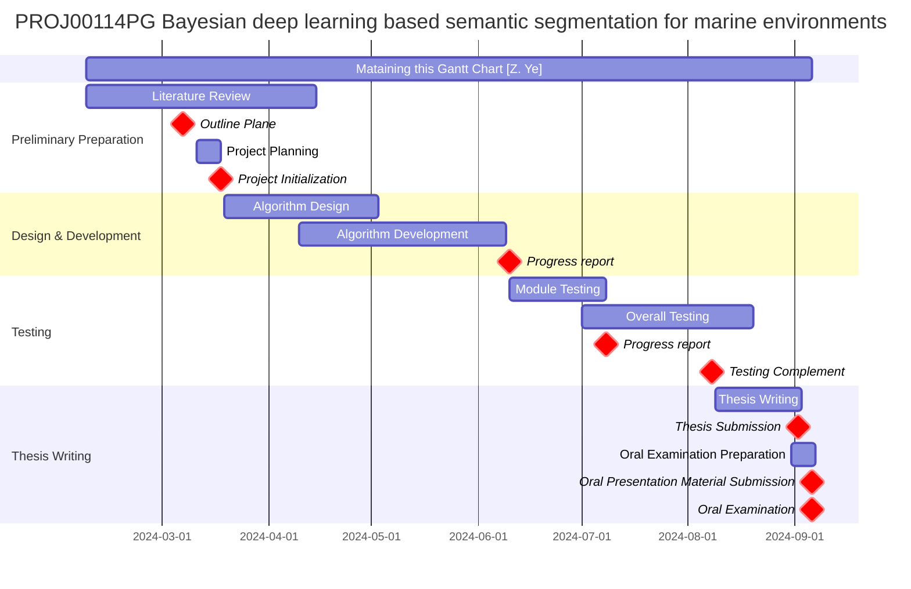

# Gantt Chart

```mermaid
gantt
    dateFormat  YYYY-MM-DD
    title PROJ00114PG Bayesian deep learning based semantic segmentation for marine environments

    Mataining this Gantt Chart [Z. Ye] : 2024-02-08, 2024-09-06

    section  Preliminary Preparation
    Literature Review: 2024-02-08, 2024-04-15
    Outline Plane: crit, milestone, 2024-03-07, 0d
    Project Planning: 2024-03-11, 2024-03-18
    Project Initialization: crit, milestone, 2024-03-18, 0d 

    section Design & Development
    Algorithm Design: 2024-03-19, 45d
    Algorithm Development : 2024-04-10, 60d
    Progress report: crit, milestone, 2024-06-10, 0d

    section Testing
    Module Testing: 2024-06-10, 28d
    Overall Testing: 2024-06-31, 50d
    Progress report: crit, milestone, 2024-07-08, 0d
    Testing Complement: crit, milestone, 2024-08-08, 0d

    section Thesis Writing
    Thesis Writing: 2024-08-09, 25d
    Thesis Submission: crit, milestone, 2024-09-02, 0d
    Oral Examination Preparation : 2024-08-31, 7d
    Oral Presentation Material Submission: crit, milestone, 2024-09-06, 0d
    Oral Examination: crit, milestone, 2024-09-06, 0d

```

