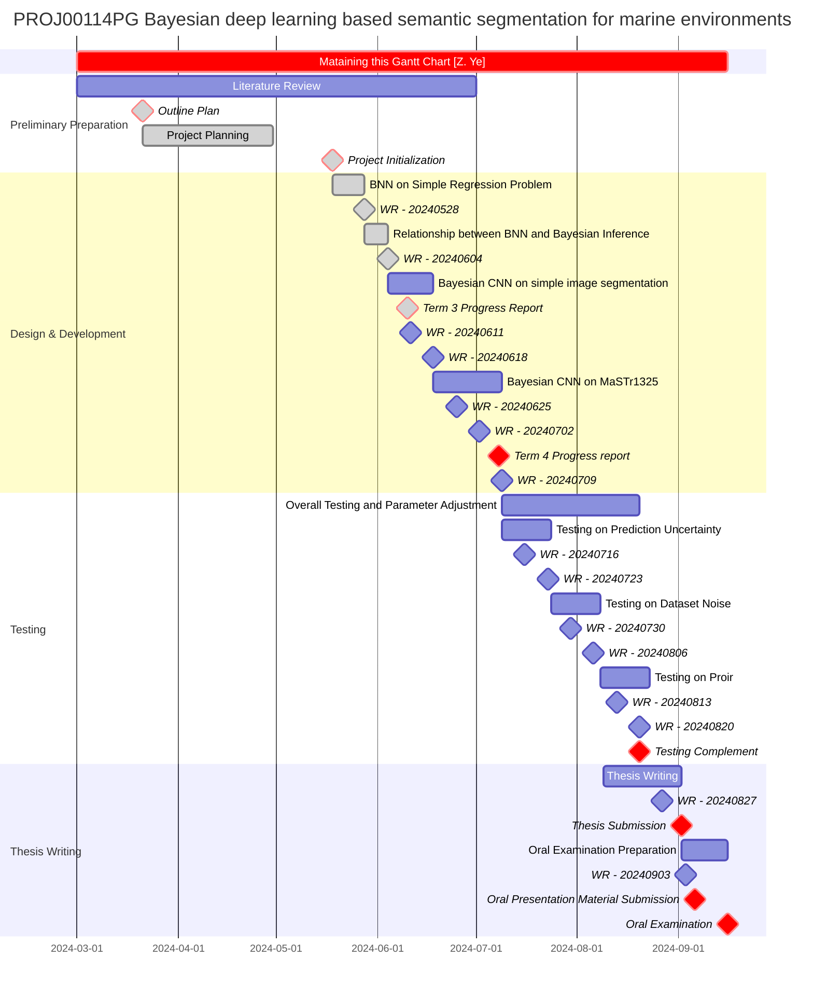

# # Gantt Chart

```mermaid
gantt
    dateFormat  YYYY-MM-DD
    title PROJ00114PG Bayesian deep learning based semantic segmentation for marine environments

    Mataining this Gantt Chart [Z. Ye] : crit, 2024-03-01, 2024-09-16

    section  Preliminary Preparation
    Literature Review: activate, 2024-03-01, 2024-07-01
    Outline Plan: done, crit, milestone, 2024-03-21, 0d
    Project Planning: done, 2024-03-21, 2024-04-30
    Project Initialization: done, crit, milestone, 2024-05-18, 0d 

    section Design & Development
    BNN on Simple Regression Problem: done, 2024-05-18, 2024-05-28
    WR - 20240528: done, milestone, 2024-05-28, 0d
    Relationship between BNN and Bayesian Inference: done, 2024-05-28, 2024-06-04
    WR - 20240604: done, milestone, 2024-06-04, 0d
    Bayesian CNN on simple image segmentation: activate, 2024-06-04, 14d
    Term 3 Progress Report: done, crit, milestone, 2024-06-10, 0d
    WR - 20240611: milestone, 2024-06-11, 0d
    WR - 20240618: milestone, 2024-06-18, 0d
    Bayesian CNN on MaSTr1325: 2024-06-18, 21d
    WR - 20240625: milestone, 2024-06-25, 0d
    WR - 20240702: milestone, 2024-07-02, 0d
    Term 4 Progress report: crit, milestone, 2024-07-08, 0d
    WR - 20240709: milestone, 2024-07-09, 0d


    section Testing
    Overall Testing and Parameter Adjustment: 2024-07-09, 2024-08-20
    Testing on Prediction Uncertainty: TPU, 2024-07-09, 15d
    WR - 20240716: milestone, 2024-07-16, 0d
    WR - 20240723: milestone, 2024-07-23, 0d
    Testing on Dataset Noise: TDN, after TPU, 15d
    WR - 20240730: milestone, 2024-07-30, 0d
    WR - 20240806: milestone, 2024-08-06, 0d
    Testing on Proir: TP, after TDN, 15d
    WR - 20240813: milestone, 2024-08-13, 0d
    WR - 20240820: milestone, 2024-08-20, 0d
    Testing Complement: crit, milestone, 2024-08-20, 0d

    section Thesis Writing
    Thesis Writing: 2024-08-09, 2024-09-02
    WR - 20240827: milestone, 2024-08-27, 0d
    Thesis Submission: crit, milestone, 2024-09-02, 0d
    Oral Examination Preparation : 2024-09-02, 2024-09-16
    WR - 20240903: milestone, 2024-09-03, 0d
    Oral Presentation Material Submission: crit, milestone, 2024-09-06, 0d
    Oral Examination: crit, milestone, 2024-09-16, 0d

```

